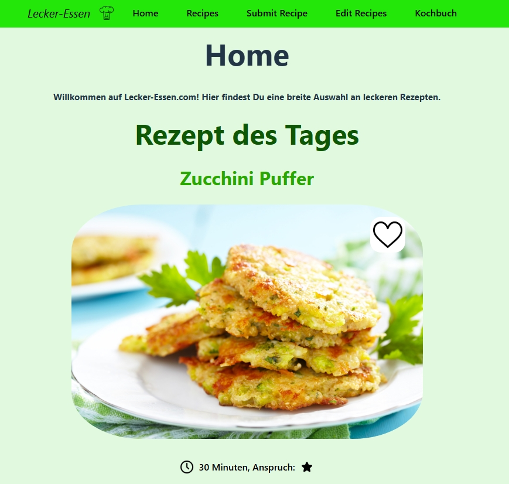
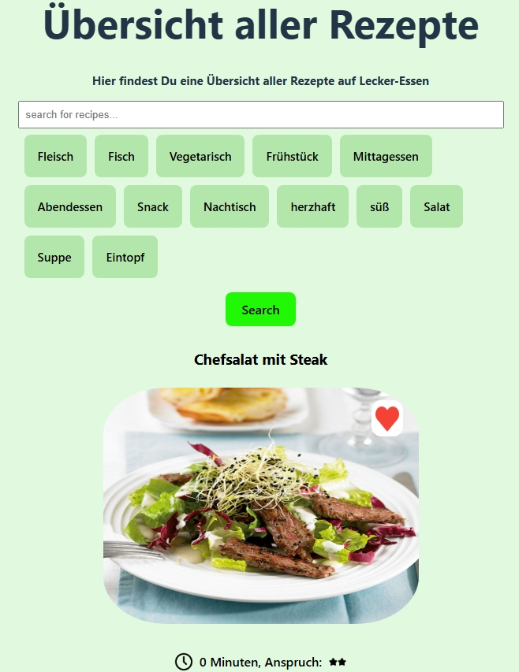
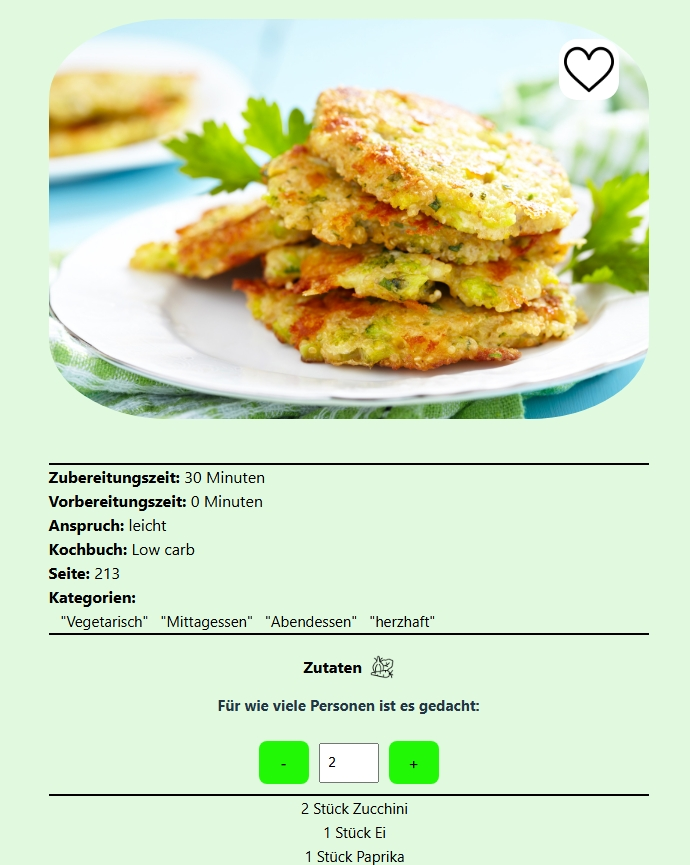
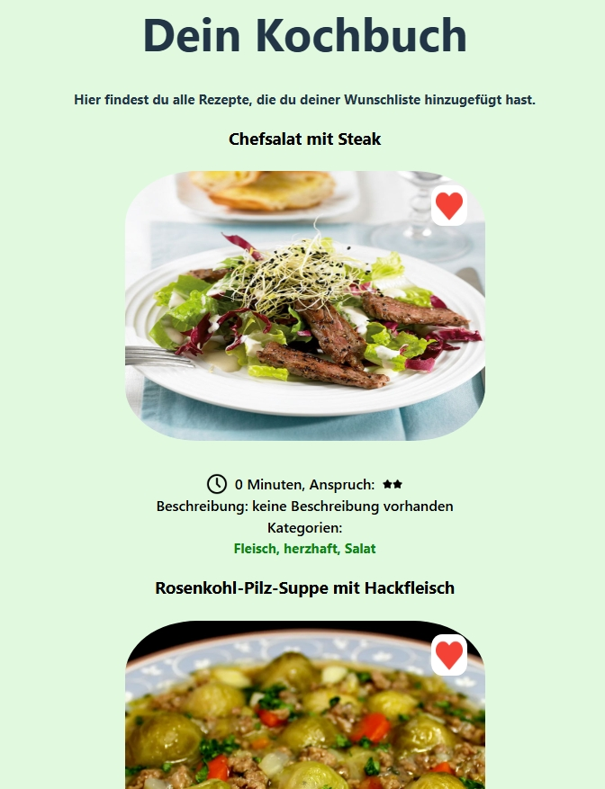
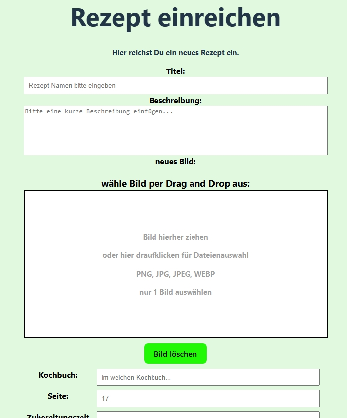

# Rezept-App – Dein digitales Kochbuch

Eine moderne Webanwendung zum Entdecken, Speichern und Verwalten von Rezepten.

## Features

- Übersicht aller Rezepte mit Bild, Zubereitungszeit, Schwierigkeitsgrad und Kategorien
- Wunschliste / Kochbuch – Rezepte mit einem Klick hinzufügen und wiederfinden
- Detaillierte Rezeptansicht mit anpassbarer Portionsgröße
- Zutatenliste und detaillierte Zubereitungsanleitung
- Rezepte einreichen und bearbeiten
- Responsives Design (funktioniert gut auf Handy, Tablet und Desktop)
- Pagination
- Bildanzeige über Azure Blob Storage

## Technologie-Stack

**Frontend:** React + TypeScript, Vite, React Router, TanStack React Query, Context API  
**Backend:** Java 21, Spring Boot 3, Spring Data JPA  
**Datenbank:** MySQL / MariaDB  

## Lokales Starten

### Voraussetzungen
- Java 21
- Node.js (v18 oder höher)
- Maven
- Postgresql

### 1. Backend starten

Öffne ein Terminal und führe aus:

```bash
cd backend/demo
./mvnw spring-boot:run

Das Backend läuft dann unter http://localhost:8080

### 2. Frontend starten

Öffne ein zweites Terminal und führe aus:

```bash
cd frontend
npm install
npm run dev

Das Frontend ist dann erreichbar unter: http://localhost:5173


### Mit Docker Compose starten (optional)

unter recipe-app diesen Befehl eingeben im Terminal:

```bash
docker-compose up --build


### Projektstruktur
recipe-app/
├── backend/
│   └── demo/                 # Spring Boot Java Backend
├── frontend/                 # React + TypeScript Frontend
├── db.sql                    # Datenbank-Schema und Beispieldaten
├── docker-compose.yml        # Optional für Docker
└── README.md

## Screenshots

### Home


### Rezept-Übersicht


### Rezept-Detailansicht


### Wunschliste / Kochbuch


### Rezept einreichen


